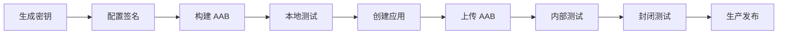

# 📱 Google Play 发布完整指南

> 本文档提供从开发到发布 Google Play 的完整流程，包括签名密钥生成、构建配置、测试和发布步骤。

## 目录

1. [前期准备](#前期准备)
2. [生成签名密钥](#生成签名密钥)
3. [配置应用签名](#配置应用签名)
4. [构建发布版本](#构建发布版本)
5. [测试 App Bundle](#测试-app-bundle)
6. [Google Play Console 设置](#google-play-console-设置)
7. [上传和发布](#上传和发布)
8. [后续更新](#后续更新)
9. [常见问题](#常见问题)

---

## 前期准备

### 1. 必需工具

确保已安装以下工具：

- ✅ **Flutter SDK** (3.0+)
- ✅ **Android SDK** (API 33+)
- ✅ **Java JDK** (11 或更高)
- ✅ **bundletool** (用于测试 AAB)

```powershell
# 检查 Flutter 环境
flutter doctor

# 检查 Android SDK
$env:ANDROID_HOME

# 检查 Java
java -version
```

### 2. 下载 bundletool

bundletool 用于从 AAB 生成 APK 进行本地测试。

```powershell
# 下载 bundletool
# https://github.com/google/bundletool/releases
# 将 bundletool-all.jar 下载到项目目录或添加到 PATH
```

### 3. Google Play 开发者账号

- 注册费用：$25（一次性）
- 注册地址：https://play.google.com/console/signup
- 完成账号验证和支付信息设置

---

## 生成签名密钥

### 🔐 理解两种密钥

Google Play 使用两层密钥系统：

1. **Upload Key (上传密钥)** 🔑
   - 用于签名上传到 Google Play 的 AAB/APK
   - 你自己保管
   - 如果丢失，可以联系 Google 重置

2. **App Signing Key (应用签名密钥)** 🔒
   - Google 代为保管
   - 用于签名分发给用户的 APK
   - 提供额外的安全层

> **推荐做法**：让 Google Play 生成应用签名密钥（首次上传时选择）

### 生成上传密钥 (Upload Key)

#### 方法一：使用 PowerShell 脚本（推荐）

创建 `generate_keystore.ps1` 脚本：

```powershell
# 生成密钥库脚本
$keystoreName = "upload-keystore.jks"
$keystoreAlias = "upload"
$validity = 10000  # 有效期（天）

Write-Host "🔐 生成 Android 上传密钥库" -ForegroundColor Green
Write-Host ""

# 提示用户输入信息\
Write-Host "请输入以下信息（将用于密钥库）：" -ForegroundColor Yellow
$storePassword = Read-Host "密钥库密码" -AsSecureString
$storePasswordText = [Runtime.InteropServices.Marshal]::PtrToStringAuto(
    [Runtime.InteropServices.Marshal]::SecureStringToBSTR($storePassword)
)

$keyPassword = Read-Host "密钥密码" -AsSecureString
$keyPasswordText = [Runtime.InteropServices.Marshal]::PtrToStringAuto(
    [Runtime.InteropServices.Marshal]::SecureStringToBSTR($keyPassword)
)

$cn = Read-Host "名称 (CN)"
$ou = Read-Host "组织单位 (OU)"
$o = Read-Host "组织 (O)"
$l = Read-Host "城市 (L)"
$st = Read-Host "省份 (ST)"
$c = Read-Host "国家代码 (C, 例如: CN)"

Write-Host ""
Write-Host "生成密钥库..." -ForegroundColor Cyan

# 生成密钥库
$dname = "CN=$cn, OU=$ou, O=$o, L=$l, ST=$st, C=$c"

keytool -genkeypair `
    -v `
    -storetype PKCS12 `
    -keystore "android\$keystoreName" `
    -alias $keystoreAlias `
    -keyalg RSA `
    -keysize 2048 `
    -validity $validity `
    -storepass "$storePasswordText" `
    -keypass "$keyPasswordText" `
    -dname "$dname"

if ($LASTEXITCODE -eq 0) {
    Write-Host ""
    Write-Host "✅ 密钥库生成成功！" -ForegroundColor Green
    Write-Host "   位置: android\$keystoreName" -ForegroundColor Cyan
    Write-Host ""
    Write-Host "📝 下一步：创建 key.properties 文件" -ForegroundColor Yellow
    
    # 生成 key.properties
    $keyPropertiesContent = @"
storeFile=$keystoreName
storePassword=$storePasswordText
keyAlias=$keystoreAlias
keyPassword=$keyPasswordText
"@
    
    $keyPropertiesPath = "android\key.properties"
    $keyPropertiesContent | Out-File -FilePath $keyPropertiesPath -Encoding UTF8
    
    Write-Host "✅ key.properties 已创建" -ForegroundColor Green
    Write-Host ""
    Write-Host "⚠️  重要提醒：" -ForegroundColor Red
    Write-Host "   1. 妥善保管密钥库文件和密码" -ForegroundColor Yellow
    Write-Host "   2. 备份到安全位置（不要提交到 Git）" -ForegroundColor Yellow
    Write-Host "   3. 密码记录在安全的密码管理器中" -ForegroundColor Yellow
} else {
    Write-Host "❌ 密钥库生成失败" -ForegroundColor Red
}
```

运行脚本：

```powershell
.\generate_keystore.ps1
```

#### 方法二：手动使用 keytool

```bash
# 在 android 目录下执行
cd android

keytool -genkeypair -v -storetype PKCS12 -keystore upload-keystore.jks \
  -alias upload -keyalg RSA -keysize 2048 -validity 10000
```

按提示输入：
- 密钥库密码（建议使用强密码）
- 密钥密码（可以与密钥库密码相同）
- 名称、组织等信息

### 🔒 验证密钥库

```powershell
# 查看密钥库信息
keytool -list -v -keystore android\upload-keystore.jks -alias upload
```

记录以下信息（稍后 Google Play Console 需要）：
- **SHA-1 指纹**
- **SHA-256 指纹**

---

## 配置应用签名

### 1. 创建 key.properties

复制示例文件并填写信息：

```powershell
Copy-Item android\key.properties.example android\key.properties
```

编辑 `android/key.properties`：

```properties
storeFile=upload-keystore.jks
storePassword=你的密钥库密码
keyAlias=upload
keyPassword=你的密钥密码
```

> ⚠️ **安全警告**：此文件已添加到 `.gitignore`，确保不要提交到版本控制！

### 2. 验证 build.gradle.kts

确认 `android/app/build.gradle.kts` 已正确配置（已完成）：

```kotlin
// 读取签名配置
def keystoreProperties = new Properties()
def keystorePropertiesFile = rootProject.file('key.properties')
if (keystorePropertiesFile.exists()) {
    keystoreProperties.load(new FileInputStream(keystorePropertiesFile))
}

// ... 签名配置部分
```

### 3. 更新应用 ID 和版本

编辑 `android/app/build.gradle.kts`：

```kotlin
defaultConfig {
    // ⚠️ 重要：修改为你的唯一包名
    applicationId = "com.yourcompany.todolist"
    
    // 版本号（每次更新需递增）
    versionCode = 1
    versionName = "1.0.0"
}
```

### 4. 更新应用名称

编辑 `android/app/src/main/AndroidManifest.xml`：

```xml
<application
    android:label="ToDoList"
    ...>
```

---

## 构建发布版本

### 🚀 使用构建脚本（推荐）

```powershell
# 构建 App Bundle（用于 Google Play）
.\build_android.ps1

# 同时构建 APK 和 AAB
.\build_android.ps1 -Type both

# 构建前清理
.\build_android.ps1 -Clean

# 构建开发版本
.\build_android.ps1 -Flavor development

# 查看帮助
.\build_android.ps1 -Help
```

### 📦 输出文件位置

构建成功后，文件位置：

- **App Bundle (AAB)**:  
  `build/app/outputs/bundle/productionRelease/app-production-release.aab`

- **APK (用于测试)**:  
  `build/app/outputs/flutter-apk/app-production-release.apk`

### 手动构建命令

```powershell
# 构建 App Bundle
flutter build appbundle --release --flavor production

# 构建 APK（多架构分包）
flutter build apk --release --flavor production --split-per-abi

# 构建单个 APK（不推荐 - 文件较大）
flutter build apk --release --flavor production
```

---

## 测试 App Bundle

### 使用 bundletool 生成测试 APK

```powershell
# 从 AAB 生成 APKs
java -jar bundletool-all.jar build-apks `
  --bundle=build/app/outputs/bundle/productionRelease/app-production-release.aab `
  --output=my-app.apks `
  --mode=universal

# 解压获取 APK
Expand-Archive my-app.apks -DestinationPath apks
```

### 安装到设备测试

```powershell
# 连接 Android 设备或启动模拟器
adb devices

# 安装 APK
adb install build/app/outputs/flutter-apk/app-production-armeabi-v7a-release.apk

# 或使用 bundletool 直接安装
java -jar bundletool-all.jar install-apks --apks=my-app.apks
```

### 测试清单 ✓

- [ ] 应用图标正确显示
- [ ] 应用名称正确
- [ ] 所有功能正常运行
- [ ] 网络请求正常（使用生产环境 API）
- [ ] 没有崩溃或错误
- [ ] 性能流畅
- [ ] 离线功能正常（如果有）
- [ ] 权限请求正常

---

## Google Play Console 设置

### 1. 创建应用

1. 访问 [Google Play Console](https://play.google.com/console)
2. 点击 **"创建应用"**
3. 填写基本信息：
   - 应用名称：ToDoList
   - 默认语言：中文（简体）
   - 应用类型：应用
   - 免费/付费：免费

### 2. 设置应用签名

首次上传时，选择：

**✅ 推荐：让 Google Play 管理并保护您的应用签名密钥**

这样：
- Google 会生成 App Signing Key
- 你使用自己的 Upload Key 上传
- 更安全且支持密钥升级

或

**自己管理应用签名密钥**（不推荐新应用）

### 3. 填写商店信息

#### 应用详情

- **应用名称**：ToDoList - 待办事项管理
- **简短说明**（80 字符以内）：
  ```
  简洁高效的待办事项管理工具，支持离线使用和云端同步
  ```

- **完整说明**（4000 字符以内）：
  ```
  ToDoList 是一款功能强大yet 简洁的待办事项管理应用。

  ✨ 主要功能：
  • 📝 事件和任务两级管理
  • 🔄 离线和在线模式自由切换
  • ☁️ 云端数据同步
  • 📊 数据统计和可视化
  • 🎨 美观的 Material Design 3 界面
  • 🌍 支持多语言（中文/英文）
  • 🔒 数据安全加密

  无论是工作任务、学习计划还是生活琐事，ToDoList 都能帮你高效管理。

  支持与反馈：
  📧 邮箱：support@todolist.com
  🌐 网站：https://todolist.com
  ```

#### 图形资源

必需提供：

1. **应用图标** (512 x 512 px, PNG, 32-bit)
2. **功能图片** (1024 x 500 px, JPG/PNG)
3. **手机截图** (2-8 张)
   - 尺寸：1080 x 1920 px 或 1080 x 2340 px
   - 展示主要功能
4. **7 英寸平板截图**（可选）
5. **10 英寸平板截图**（可选）

#### 分类

- **应用类别**：效率
- **标签**：待办事项、任务管理、效率工具

#### 联系信息

- **电子邮件**：你的邮箱
- **网站**：应用网站（可选）
- **隐私政策**：隐私政策 URL（必需）

### 4. 内容分级

完成内容分级问卷：

1. 选择应用类别：效率
2. 回答内容相关问题
3. 获得分级（通常为 "3+" 或 "Everyone"）

### 5. 定价和分发

- **价格**：免费
- **分发国家/地区**：选择要发布的国家
- **是否包含广告**：否（根据实际情况）
- **目标受众**：所有人

### 6. 应用内容

- **隐私政策**：提供 URL
- **数据安全表单**：说明收集哪些数据

示例数据安全说明：
```
我们收集的数据：
• 电子邮件地址（用于账户登录）
• 待办事项内容（存储在加密数据库）
• 设备信息（用于同步）

数据传输：所有数据通过 HTTPS 加密传输
数据存储：使用 AES 加密存储
数据删除：用户可随时删除账户和所有数据
```

---

## 上传和发布

### 1. 创建版本

1. 进入 **"发布" > "生产"**
2. 点击 **"创建新版本"**
3. 上传 App Bundle：
   ```
   build/app/outputs/bundle/productionRelease/app-production-release.aab
   ```

### 2. 版本说明

填写版本说明（支持多语言）：

```
v1.0.0 首次发布

新功能：
• 待办事项管理
• 离线和在线模式
• 数据云端同步
• 多语言支持
```

### 3. 审核和发布

- **内部测试**：上传给内部测试人员（最多 100 人）
- **封闭测试**：小范围测试（自定义人数）
- **开放测试**：公开测试（任何人可参与）
- **生产**：正式发布

**推荐流程**：

```
内部测试 → 封闭测试 → 开放测试 → 生产发布
 (1-2天)    (1周)      (1-2周)    (审核后)
```

### 4. 审核时间

- 首次审核：1-3 天
- 后续更新：通常几小时到 1 天

---

## 后续更新

### 更新版本流程

1. **修改版本号**

编辑 `pubspec.yaml`：
```yaml
version: 1.0.1+2  # 格式：主版本.次版本.修订版本+构建号
```

或编辑 `android/app/build.gradle.kts`：
```kotlin
versionCode = 2      // 必须递增
versionName = "1.0.1"
```

2. **构建新版本**

```powershell
.\build_android.ps1 -Clean
```

3. **测试新版本**

4. **上传到 Google Play Console**

5. **填写更新说明**

```
v1.0.1 更新内容

修复：
• 修复某某bug
• 提升性能

优化：
• 界面优化
```

### 版本号管理

- **versionCode**: 整数，每次发布必须递增
- **versionName**: 字符串，显示给用户的版本号

建议规则：
```
1.0.0+1   - 首次发布
1.0.1+2   - Bug 修复
1.1.0+3   - 新功能
2.0.0+4   - 重大更新
```

---

## 常见问题

### ❓ 构建失败：找不到签名配置

**解决**：
```powershell
# 检查 key.properties 是否存在
Test-Path android\key.properties

# 检查密钥库文件
Test-Path android\upload-keystore.jks

# 验证 key.properties 内容
Get-Content android\key.properties
```

### ❓ 上传失败：版本号冲突

**解决**：
```kotlin
// 增加 versionCode
versionCode = 2  // 递增此值
```

### ❓ 安装失败：INSTALL_FAILED_UPDATE_INCOMPATIBLE

**原因**：签名不匹配

**解决**：
```powershell
# 先卸载旧版本
adb uninstall com.todolist.mobile

# 再安装新版本
adb install <apk文件>
```

### ❓ 密钥库密码忘记

**解决**：
- Upload Key：可以联系 Google Play 支持重置
- 本地测试：重新生成新的密钥库（仅用于开发）

### ❓ SHA-1 指纹不匹配

**查看签名指纹**：
```powershell
keytool -list -v -keystore android\upload-keystore.jks -alias upload
```

在 Google Play Console 更新指纹。

### ❓ 应用被拒绝

常见原因：
- 缺少隐私政策
- 内容分级错误
- 图标或截图不符合规范
- 应用崩溃或有严重 bug

**解决**：根据拒绝原因修改后重新提交

### ❓ ProGuard 导致崩溃

**检查 ProGuard 规则**：

编辑 `android/app/proguard-rules.pro`，添加需要保留的类：

```pro
-keep class your.package.model.** { *; }
-keep class your.package.api.** { *; }
```

禁用混淆进行测试：
```kotlin
minifyEnabled = false
shrinkResources = false
```

---

## 安全检查清单

发布前确认：

- [ ] ✅ Upload Key 已安全备份（多个位置）
- [ ] ✅ key.properties 未提交到 Git
- [ ] ✅ 密码保存在密码管理器中
- [ ] ✅ .env 配置为生产环境
- [ ] ✅ 应用 ID 已修改为正式包名
- [ ] ✅ 调试代码已移除
- [ ] ✅ API 密钥已替换为生产环境
- [ ] ✅ 已完整测试所有功能
- [ ] ✅ 性能测试通过
- [ ] ✅ 截图和图标准备完整

---

## 有用的链接

- [Google Play Console](https://play.google.com/console)
- [Android 应用签名文档](https://developer.android.com/studio/publish/app-signing)
- [Flutter 发布文档](https://docs.flutter.dev/deployment/android)
- [bundletool 下载](https://github.com/google/bundletool/releases)
- [Google Play 政策中心](https://play.google.com/about/developer-content-policy/)

---

## 总结

完整的发布流程：



祝你发布顺利！🎉

如有问题，请参考本文档或访问 Google Play 帮助中心。
